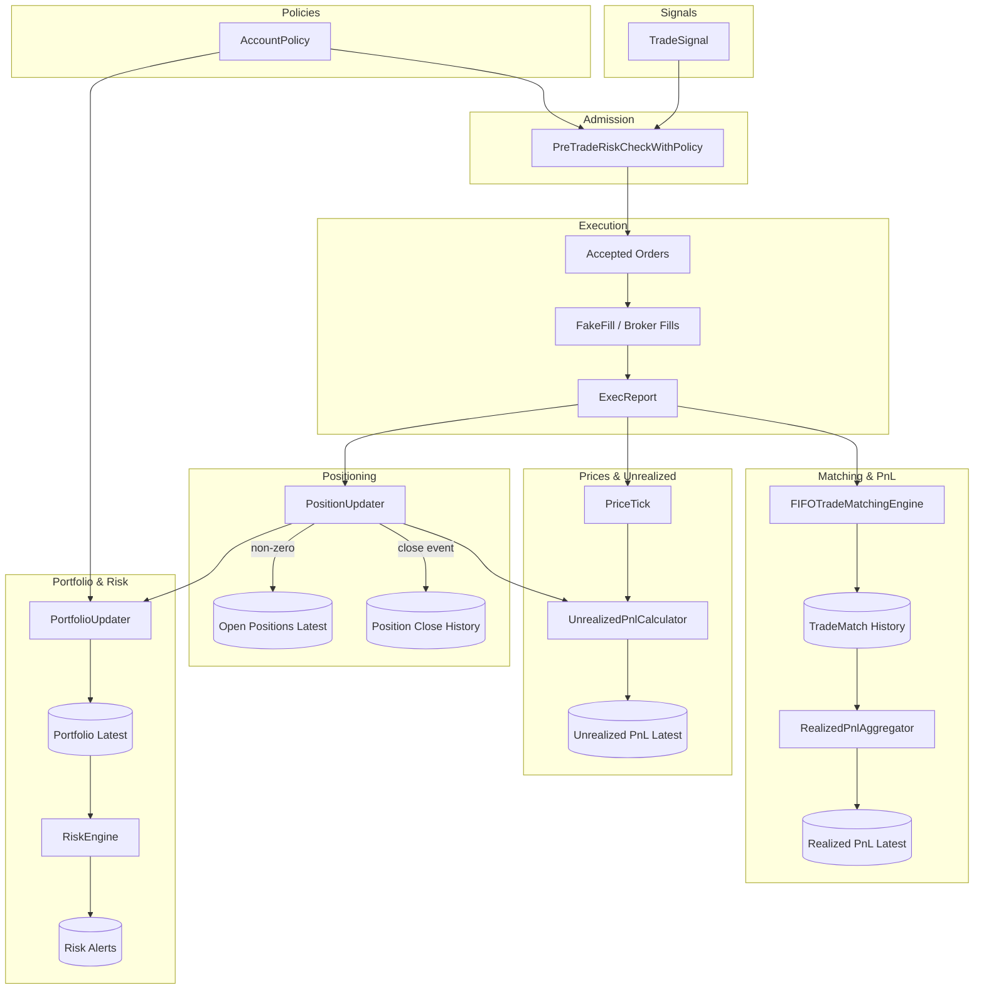

## Trading Engine Architecture

### Purpose
This document describes the end-to-end architecture for order admission, execution, position management, FIFO trade matching, and P&L tracking. It clarifies what lives in operator state vs. what is stored in append-only history and latest snapshots for query.

### High-level flow

### Components and responsibilities
- PreTradeRiskCheckWithPolicy
  - Enforces admission rules (order notional caps, max open symbols). Admission state should be short‑lived and not considered the source of truth for inventory. The source of truth for inventory is executions (ExecReports).

- FakeFill / Broker Fills
  - Produces `ExecReport` reflecting actual fills. In production, replace with real broker integration.

- PositionUpdater
  - Maintains canonical open inventory per account-symbol: `netQty`, `avgPrice`, `lastUpdated`.
  - Emits only non-zero positions on its main output (Open Positions Latest).
  - When `netQty` crosses to 0 (flat), emits a one-off close event to Position Close History and clears keyed state for that symbol (so state contains only open trades).
  - Exposure for Portfolio aggregation is derived from open positions.

- FIFOTradeMatchingEngine
  - Maintains unmatched lots (e.g., buys for long flow; can be extended to track sells for short flow).
  - Matches incoming opposing fills FIFO and emits `TradeMatch` records containing matched qty, prices, and realized P&L.
  - The TradeMatch stream is the immutable trade history for realized P&L auditing and analytics.

- RealizedPnlAggregator
  - Aggregates `TradeMatch` realized P&L per account-symbol into a running total and emits a Latest snapshot for fast reads.
  - Use TradeMatch history for full audit; use Realized P&L Latest for dashboards.

- PriceTick and UnrealizedPnlCalculator
  - Joins latest open position with the latest price to compute unrealized P&L per account-symbol.
  - Emits an Unrealized P&L Latest upsert stream. In production, PriceTick should come from market data rather than ExecReport prices.

- PortfolioUpdater
  - Composes Portfolio from:
    - Cash/equity baseline (from policy/funding)
    - Exposure (from open positions)
    - Optionally joins in Realized and Unrealized P&L for full equity representation (depending on desired semantics)
  - Emits Portfolio Latest for UI/monitoring.

- RiskEngine
  - Consumes Portfolio Latest to trigger alerts (e.g., exposure caps, drawdown, margin).

### Storage model (Fluss or similar)
- Latest/upsert tables (for current state):
  - Open Positions Latest (accountId, symbol, netQty, avgPrice, lastUpdated)
  - Portfolio Latest (accountId, equity, cashBalance, exposure, marginUsed)
  - Unrealized P&L Latest (accountId, symbol, unrealizedPnl, currentPrice)
  - Realized P&L Latest (accountId, symbol, cumulativeRealizedPnl)

- Append-only history tables (for analytics & audit):
  - ExecReport History (raw fills)
  - TradeMatch History (matched pairs with realized P&L)
  - Position Close History (one record for each open→close transition with entry/exit, size, duration, and aggregated realized P&L while open)

### State lifecycle and correctness
- Position state is kept only for open symbols; on flat (netQty→0), emit close, clear state.
- Matcher state keeps only unmatched lots; emits TradeMatch for each match.
- Ensure ExecReports are idempotent/deduplicated (e.g., by orderId+sequence) to avoid double counting in matching/position and realized P&L.
- Prefer deriving inventory and P&L solely from fills (ExecReports) for correctness under rejections/partials.
- Consider state TTL for guardrails, but do not rely on TTL for correctness.

### Pre-trade checks vs. execution
- Admission checks limit orders based on policy and a lightweight notion of current exposure, but all long-lived inventory comes from ExecReports.
- If reserving capacity before execution is required, emit explicit reservations with timeouts and reconcile against fills.

### Scaling and keys
- Key all critical flows by `accountId|symbol`:
  - PositionUpdater, FIFO matcher, unrealized P&L calculator
- This guarantees in-order processing per instrument, keeps state consistent, and scales horizontally across keys.

### Queries and use cases
- What’s my current exposure and open P&L? Read Open Positions Latest + Unrealized P&L Latest.
- What’s my realized P&L by day/week/strategy? Query TradeMatch History aggregated by window; use Realized P&L Latest for point-in-time snapshot.
- What positions did I open and when did I close them? Query Position Close History.
- Has my account breached limits? Read Portfolio Latest and Risk Alerts.

### Future refinements
- Short inventory support in matcher (keep unmatched sells and match buys against sells for net short flows).
- Market-data driven PriceTicks with watermarking and late-data handling for robust unrealized P&L.
- Exactly-once/source deduplication for ExecReports to guarantee accounting correctness under retries.
- Enrich Position Close History with lifetime realized P&L (sum of TradeMatch while position open) and holding period metrics.

