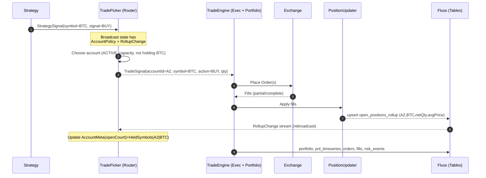

# TradeEngine

A modular, streaming-first trading system built on **Apache Flink** + **Apache Fluss**.
This project is the successor to our old `PortfolioAndRiskJob`: portfolio, risk, and order flow are now consolidated in a single **TradeEngine**.

---

## Architecture Overview

```
StrategySignal (strategy outputs, keyed by symbol)
        │
        ├─── connect ──► [TradePicker (broadcast: AccountPolicy + RollupChange)]
        │                                   │
        │                                   └─ maintains AccountMeta + HeldSymbols
        ▼
   TradeSignal (with chosen accountId)
        │
        ├─► Execution Adapter ──► Orders ──► Fills ──┐
        │                                            │
        └────────────────────────────────────────────┤
                                                     ▼
                                             PositionUpdater
                                                     │
                                ┌────────────────────┴───────────────────┐
                                ▼                                        ▼
                       RollupChange → Fluss.open_positions_rollup   Portfolio/P&L → Fluss
                                │
                                └─► rebroadcast into TradePicker
```

---

## Streams

### Inputs
- **`StrategySignal`**: signals from strategies (`BUY`/`SELL`, strength, SMA/EMA values, etc.).
- **`RollupChange`**: authoritative open-position deltas from `open_positions_rollup` (per account, per symbol).
- **`AccountPolicy`**: account-level risk rules (`status`, `maxOpenSymbols`, optional capital).

### Outputs
- **`TradeSignal`**: routed trade, enriched with chosen `accountId`.
- **`PositionRollupChange`**: authoritative position deltas, persisted into Fluss.
- **Portfolio / P&L snapshots**: per-account equity, exposure, realized/unrealized P&L.
- **Risk events**: kill-switch, breaches, etc.

---

## Core Operators

### 1. TradePicker (Account Router)
- **Purpose**: Decide which account gets a new trade, based on capacity and current holdings.
- **Inputs**: `StrategySignal` + broadcasted `AccountPolicy` + broadcasted `RollupChange`.
- **State**:
    - `AccountMeta`: accountId → (status, maxOpenSymbols, openCount)
    - `HeldSymbols`: (accountId|symbol) → open?
- **Logic**:
    1. Prefer ACTIVE accounts not holding the symbol, least `openCount`.
    2. If none and `allowScaleIn = true`, pick account already holding the symbol.
    3. If no capacity, drop.
- **Output**: `TradeSignal{accountId, symbol, action, qty, ts}`

### 2. TradeEngine
- **Order Adapter**: routes `TradeSignal` to exchange, manages orders/fills.
- **PositionUpdater**: maintains net qty, avg price, emits `RollupChange`.
- **Portfolio Aggregator**: calculates equity, realized/unrealized P&L, exposure.
- **Risk Guard**: applies account-level rules (capital, drawdown, kill-switch).
- **Persistence**: writes portfolio, positions, fills, risk events into Fluss.

---

## Data Model (simplified)

### StrategySignal
```java
public class StrategySignal {
  String runId;
  String symbol;
  long timestamp;
  double close, sma5, sma21;
  String signal; // BUY/SELL
  double signalStrength;
}
```

### TradeSignal (output of TradePicker)
```java
public class TradeSignal {
  String signalId;   // runId + timestamp
  String accountId;  // chosen by TradePicker
  String strategyId;
  String symbol;
  String action;     // BUY/SELL
  double qty;
  long ts;
}
```

### AccountPolicy
```java
public class AccountPolicy {
  String accountId;
  int maxOpenSymbols;
  String status;     // ACTIVE/BLOCKED
  double initialCapital;
  long ts;
}
```

### RollupChange
```java
public class RollupChange {
  Op op;             // UPSERT / DELETE
  String accountId, strategyId, symbol;
  double netQty, avgPrice;
  long ts;
}
```

---

## State Ownership

- **Flink Keyed State (fast, volatile)**
    - in-flight orders
    - transient metrics (rolling drawdown, etc.)

- **Fluss (authoritative, persistent)**
    - `open_positions_rollup`
    - `portfolio`
    - `fills`, `orders`, `risk_events`
    - `pnl_timeseries`

---

## Testing

### Harness tests
- TradePicker account selection (capacity, scale-in, tie-break).
- Rollup transitions (OPEN → CLOSED → OPEN).
- Risk guard kill-switch scenarios.

### MiniCluster integration tests
- End-to-end flow with real Flink job graph.
- Test sinks (`TradePickerRollupTestSink`, `TradeSignalCollectSink`) used to assert behavior.

Example:

```java
var routed = TradePicker.build(
    env,
    strategySignals,
    rollupDeltas,
    policies,
    /*defaultQty*/ 1.0,
    /*allowScaleIn*/ true
);

routed.sinkTo(new TradeSignalCollectSink());
rollupDeltas.sinkTo(new TradePickerRollupTestSink());
```

---

## Backtest vs Live

- **Backtest**:
    - feed historical StrategySignals
    - simulate fills/execution
    - Fluss in batch mode

- **Live**:
    - real execution adapters
    - Fluss in streaming mode
    - same rollup feedback loop

---

## Observability

- **Grafana dashboards** via Fluss tables (`portfolio`, `open_positions_rollup`, `risk_events`, `pnl_timeseries`).
- **Flink metrics/logs** (backpressure, latency).
- **Custom metrics**: routed vs dropped trades, per-account capacity usage.

---

## TODO / Next Steps

- 🔧 Replace constant `defaultQty` with sizing model (`qty = f(signalStrength, volatility, capital)`).
- 🔧 Fairness: add round-robin tiebreak when accounts tie.
- 🔧 Extend RiskGuard with per-account P&L drawdown, capital usage %.
- 🔧 Add more MiniCluster tests (capacity limit, blocked-account SELL allowed).
- 🔧 Optimize broadcast state if account universe grows large (consider sharding or external lookup).

---


## Sequence Diagram (BUY happy path)



### Notes
- TradePicker prefers accounts **not holding** the symbol, then least `openCount`. If none, optional scale-in to holders.
- PositionUpdater writes authoritative `open_positions_rollup`; those changes feed back to the router.
- Portfolio/P&L snapshots are written independently to Fluss for dashboards.
